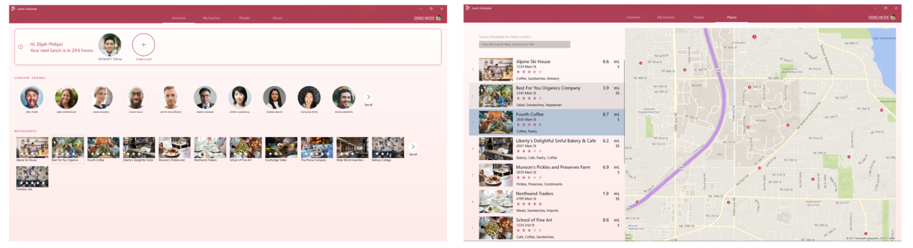

<!---
    category: Fluent
-->

# Lunch Scheduler app

Lunch Scheduler is a Universal Windows Platform (UWP) sample that schedules lunches with your friends and coworkers. 
You can invite friends to a restaurant of interest and the app takes care of the lunch management for all involved parties.

> Note - This sample is targeted and tested for Windows 10, version 1903 (10.0; Build 18362), and Visual Studio 2019. If you prefer, you can use project properties to retarget the project(s) to Windows 10, version 1809 (10.0; Build 17763), and/or open the sample with Visual Studio 2017.

This app highlights the following:

- Integration with services like Facebook and Microsoft Graph for authentication, user operations, and friends discovery.
- Services like Yelp and Bing maps for restaurant recommendations.
- Elements of the [Fluent Design System](https://fluent.microsoft.com/) in a UWP app including acrylic, reveal, 
and connected animations.



This sample uses the following client libraries and services:
- UWP Community Toolkit for Facebook authentication and Facebook Graph API operations
- Microsoft Graph service
- Yelp service for restaurant recommendations
- Bing maps service for rendering maps and location

> Important: This is an OSS project under the MIT license, however, the images are included for demonstration purposes only 
(persons and restaurants) and cannot be distributed. They may only be used within the confines of this sample. 
These images are copyrighted by Getty images, and usage is limited to the personal use and testing of this sample as outlined 
in the license file.

## Prerequisites

- Windows 10. Minimum: Windows 10, version 1809 (10.0; Build 17763), also known as the Windows 10 October 2018 Update.
- [Windows 10 SDK](https://developer.microsoft.com/windows/downloads/windows-10-sdk). Minimum: Windows SDK version 10.0.17763.0 (Windows 10, version 1809).
- [Visual Studio 2019](https://visualstudio.microsoft.com/downloads/). You can use the free Visual Studio Community Edition to build and run Windows Universal Platform (UWP) apps.

To get the latest updates to Windows and the development tools, and to help shape their development, join 
the [Windows Insider Program](https://insider.windows.com).

You must also install the latest [.NET Core SDK](https://www.microsoft.com/net/core) and then ensure the following components are installed in Visual Studio, or you may receive build errors. To do this, launch Visual Studio Installer and ensure that all of these components are selected:

- Universal Windows Platform development
- ASP.NET and web development
- Azure development
- .NET Core cross-platform development

## Running the sample

Lunch Scheduler utilizes a number of services that require registration and developer keys to function. 
To help you get going quickly, Lunch Scheduler can be run in two different modes. 

- **Demo mode:** No services are used. The data and users shown are fictitous, allowing you to demo the flow 
and functionality of the app without any setup. 
- **Standard mode:** Utilizes your service keys to populate the app with live data for a more realistic, 
production-grade experience. 

### Demo mode

After downloading or cloning the GitHub repo, simply open the solution in Visual Studio 2017 Preview, select the appropriate 
architecture, and press F5 to build and run. Choose **Demo** at the login prompt to enter demo mode. 
Note: while other options are shown, they will not work until configured. 

### Standard mode

You can use the Lunch Scheduler app with real services and data. When you enter standard mode, 
by signing in with a real account, you have the ability to authenticate with Facebook or Microsoft Graph to retrieve 
user profile information for the signed-in user, and coworkers and friends, to use in the app. Also, you can leverage the 
Yelp service for restaurant recommendations, and Bing maps for location and mapping support. **To use any of these service 
providers you'll need to register at their respective portals, and reference the application IDs in the app.** 
This section provides guidance on how to: 
1. Configure the app for each service provider.
2. Configure the Lunch Scheduler service to run locally.

> Note: You don't need to configure all of the services for the app to work in standard mode. 
For example, you can configure either Facebook *or* Microsoft Graph to supply your coworkers or friends list. 
However, for the restaurant selections and mapping functionality, you'll need to use the Yelp service and Bing Maps to complete the **Create a lunch** workflow.

#### Get started

Under **LunchScheduler.Models**, open **Constants.cs** and set: 

```IsDemoMode = false;```

#### Using Facebook 
The Lunch Scheduler sample uses the UWP Community Toolkit for Facebook integration. This includes authentication and calling 
into the Facebook Graph API for user and friends profile information. You'll need to register this app at the Facebook developer 
site and retrieve the app ID for the sample.

1. To register your app with Facebook see and complete the steps outlined at [Facebook Service](https://developer.microsoft.com/en-us/windows/uwp-community-toolkit/services/facebook). 
> Note: You can also retrieve the app Microsoft Store ID detailed in the above topic by right clicking the project in Visual Studio 
and select **Store -> Associate App with the Store.** Then follow the instructions in the wizard. 
You don't actually need to submit the app to the Store, just associate it.

2. Under **LunchScheduler.Models** open **Constants.cs**. Copy the app ID and the Microsoft Store app ID values into the 
Facebook app registration section.

#### Using Microsoft Graph

You can also authenticate with the Microsoft Graph service and use the Microsoft Graph API to retrieve user and 
coworkers from an Office 365 tenant. You'll need an Office 365 business account, or developer account, to create contacts 
to use in Lunch Scheduler. If you don't have one currently you can sign up for a demo subscription here 
at [Set up your Office 365 development environment](https://msdn.microsoft.com/en-us/office/office365/howto/setup-development-environment#bk_Office365Account).

> Note: Although this app supports V2 authentication against the Azure endpoint supporting both organizational 
and Microsoft accounts, you'll need to use an organizational account for this sample such as, Office 365. 
Adding discovering coworkers/contacts from personal or Microsoft accounts like outlook.com or hotmail is not supported.

1. Sign into the [App Registration Portal](https://apps.dev.microsoft.com/) using either your personal or work or school account.
2. Select **Add an app**.
3. Enter a name for the app, and select **Create**.
	
	The registration page displays, listing the properties of your app.
 
4. Under **Platforms**, select **Add platform**.
5. Select **Native Application**.
6. Copy both the Application Id and Redirect URI values to the clipboard. You'll need to enter these values into the sample app.

	The app id is a unique identifier for your app. The redirect URI is a unique URI provided by Windows 10 
	for each application to ensure that messages sent to that URI are only sent to that application. 

7. Select **Save**.
8. Ensure your Office 365 environment is **configured with accounts that have a profile picture, display name, and email address**. 
If these fields are not populated for the user, then the info will not be returned into Lunch Scheduler when running the app.
9. Under **LunchScheduler.Models** open **Constants.cs**. Copy the app ID and the Redirect URI values into the Microsoft app 
registration section.

#### Using Bing maps for mapping and location-based services

Lunch Scheduler needs a Bing Maps key to run with full functionality. For security reasons, we can't provide a key as 
part of the sample - you'll need to get your own at https://www.bingmapsportal.com.  Under **LunchScheduler.Models** 
open **Constants.cs**. Copy the key/token into the Bing Maps app registration section.

#### Using Yelp for restaurant suggestions

To use Yelp: 

1. Create a free [Yelp](https://www.yelp.com) account and log in. 
2. Obtain the Client ID and Client Secret from the Yelp [developer portal](https://www.yelp.com/developers/manage_api_keys) registration process. 
3. Under **LunchScheduler.Models** open **Constants.cs**. Copy the **Client ID** and the **Client Secret** values into the Yelp app registration section.

For more information on using the Yelp API, see the [Yelp documentation](https://www.yelp.com/developers/documentation/v2/overview). 

#### Run Lunch Scheduler app service locally

Here's how to run the service locally alongside the app:   

1. Right click your solution and select **Properties**.
2. Select the **Startup Project** tab.
3. Check the **Multiple startup projects** radio button.
4. Enable both *LunchScheduler* and *LunchScheduler.Api* to start.
5. Right click the **LunchScheduler.Api** project, select the project properties
6. On the **Debug** menu retrieve the **App URL** value and paste it into the **Constants.cs** file (look for ```public const string ApiUrl```).
7. Open **App.xaml.cs**. In the OnLaunched event, find and replace the LunchDemoRepository reference. 
This will route traffic through to the services being implemented in this section.  

    Change this:

    ```
    Api = new LunchDemoRepository(("Data Source=" + 
        Path.Combine(ApplicationData.Current.LocalFolder.Path, "LunchScheduler.db"));
    ```

    To this:

    ```
    Api = new LunchRestRepository(Models.Constants.ApiUrl);
    ```

8. Finally, open **Constants.cs** again and supply a unique value for the JwtSecretKey. This can be any value and it's required for secure 
communication between the app service and the client app.
9. Run the app.

The next time you run the sample, both the service and the app will launch (with debugging enabled) simultaneously. 
You might need to wait a moment to make sure the service is running, but once it is you can proceed normally.

## Code at a glance
If you're just interested in code for certain portions of the sample, check out the following files for some of our highlighed features:

### Connected animations
Connected animations let you create more dynamic navigation experiences by animating the transition of an element between 
two different views. For more informations about them, you can read the docs [here](https://docs.microsoft.com/windows/uwp/style/connected-animation) or review the following code files:

* [MainPage.xaml.cs](LunchScheduler/MainPage.xaml.cs#L34)
* [LoginPage.xaml.cs](LunchScheduler/Views/LoginPage.xaml.cs#L34)

### Reveal highlight

Reveal is a lighting effect that helps bring depth and focus to your apps's interactive elements. 
You can read more about the effect [here](https://docs.microsoft.com/windows/uwp/style/reveal) or see it in use by 
running the app and looking at the top navigational control.

### Acrylic

Acrylic material is a type of Brush that creates a partially transparent texture, which can be applied to app surfaces 
to add depth and help establish a viual hierarchy. You can learn more about acrylic 
usage [here](https://docs.microsoft.com/windows/uwp/style/acrylic) or review the following code files:
* [MainPage.xaml](LunchScheduler/MainPage.xaml#L34)
* [CreateLunchPage.xaml](LunchScheduler/Views/CreateLunchPage.xaml#L34)

### Authentication

Authentication services allow you to verify users, as well as access profile and other information about them. 
This sample demonstrates using the Microsoft and Facebook Graph services for this purpose. For more information, 
review the following code files:
* [AuthenticationViewModel.cs](LunchScheduler/ViewModels/AuthenticationViewModel.cs#L34)

### Location and restaurant data

Bing Maps and the Yelp service provide data for your lunches. For more detail about using these services see the following code files:

* [LocationHelper.cs](LunchScheduler/Common/LocationHelper.cs#L34)
* [RestaurantsController.cs](LunchScheduler.Api/Controllers/RestaurantsController.cs#L34)


