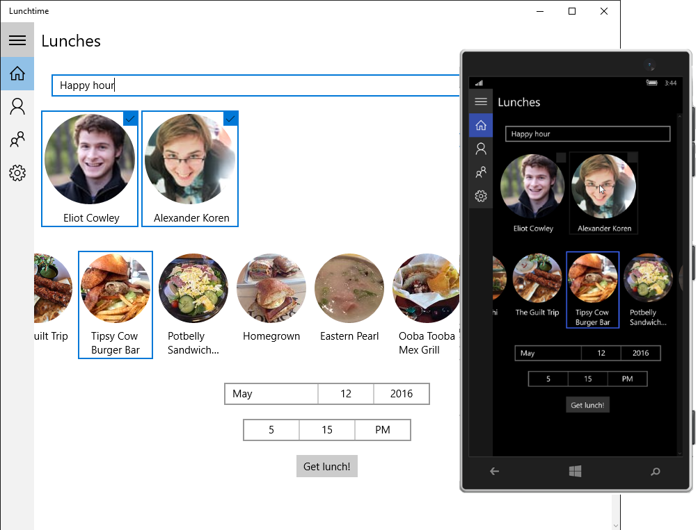

<!---
  category: AppSettings ControlsLayoutAndText Data IdentitySecurityAndEncryption MapsAndLocation Navigation NetworkingAndWebServices TilesToastAndNotifications
-->

# Lunch Scheduler app sample

A mini-app that simplifies organizing lunch with friends or co-workers. 
You choose a time and location, invite friends, and the app takes care of sending out notifications and collecting responses.
This sample runs on the Universal Windows Platform (UWP). 

The app demonstrates features you may find useful for your own projects, like push notifications, user authentication, UI controls, and Azure integration.

## Features

Lunch Scheduler highlights features like: 

- Out Of Box Experience (OOBE)
- Authentication using a Microsoft or Facebook account
- Basic app UI and navigation, including a navigation pane and settings page
- Integration with third party services such as [Yelp](https://www.yelp.com) and [Twilio](https://www.twilio.com)

Lunch Scheduler is designed to run well on both Windows PC and Windows Phone.  

## Run the sample

Because Lunch Scheduler relies on some authentication APIs and third party services, it requires a bit of setup before you can run it.

### Prepare your environment

This sample requires Visual Studio 2015, the Windows 10 SDK (build 14393 or above), and the Azure SDK.

* [Get a free copy of Visual Studio 2015 Community Edition with support for building Universal Windows apps](http://go.microsoft.com/fwlink/?LinkID=280676)
* [Get the Azure SDK](https://azure.microsoft.com/downloads/)

Additionally, to receive the latest updates to Windows and the development tools, and to help shape their development, join the [Windows Insider Program](https://insider.windows.com/ "Become a Windows Insider").

### Associate Lunch Scheduler with the Store

Lunch Scheduler uses APIs that require store association. To associate the app with the Store, right click the project in Visual Studio and select **Store** -> **Associate App with the Store**. Then follow the instructions in the wizard. 

Note that you don't actually need to submit the app to the Store, just associate it. 

### Configure 3rd party services

Lunch Scheduler integrates a number of 3rd party services that require some additional setup to function correctly.

You don't necessarily need to configure these before running the app. However, if you try and use one and it's not configured, the app might throw an exception.  

#### Yelp

Lunch Scheduler uses Yelp to suggest tasty lunch spots near your current location. 

To use Yelp: 

1. Create a free [Yelp](https://www.yelp.com) account and log in. 
2. Obtain API keys from the [developer portal](https://www.yelp.com/developers/manage_api_keys). 
3. Swap the Consumer Key, Consumer Secret, Token, and Token Secret into the constants in the *site/controllers/LocationsController.cs* file. 

For more information on using the Yelp API, see the [Yelp documentation](https://www.yelp.com/developers/documentation/v2/overview). 

#### Facebook

Using a Microsoft Account (MSA) is the easiest way users can authenticate with Lunch Scheduler. However, the app also offers the option to log in with Facebook. 

To turn on Facebook authentication: 

1. Navigate to the [Facebook developer panel](https://developers.facebook.com/apps/). 
2. Select **Add a New App** and choose the **Website** template.
3. Complete the form. Specifically, make sure to fill in the Windows Store SID field. You can obtain your SID from the [Windows Developer Dashboard](https://developer.microsoft.com/dashboard/). 
4. Insert your App ID and App Secret into the constants in the [AuthenticationHelper.cs](app/helpers/AuthenticationHelper.cs) and [IdpHelper.cs](site/helpers/IdpHelper.cs) files. 

For more information, see the [Facebook documentation](https://developers.facebook.com/docs/facebook-login). 

#### Twilio

Twilio is a service that enables sending and receiving text messages via an API. Lunch Scheduler can optionally use Twilio to send a text notification to users when they are invited to lunch. 

To enable Twilio: 

1. Create a free [Twilio](https://www.twilio.com/) account and log in.
2. Create a new trial phone number from the [Phone Numbers Dashboard](https://www.twilio.com/console/phone-numbers/dashboard). 
3. Change the URL endpoint for the "message comes in" field on the numbers dashboard to the URL of your LunchScheduler service's device endpoint. For example: https://<your_url_here>.azurewebsites.net/api/device?ZUMO-API-VERSION=2.0.0. 
4. Add your Twilio phone number, SID, and key to the constants in the *site/helpers/NotificationHelper.cs* file. 

For a more complete tutorial on getting started with Twilio using C#/.NET, check out the [Twilio documentation](https://www.twilio.com/api).

### Set the API endpoint

In [ApiHelper.cs](app/Helpers/ApiHelper.cs), set the value of the BaseUrl constant to match the url the backing service is running on. See the next step for how to run the service.  

### Start the service

Lunch Scheduler relies on a backing [Azure App Service](https://azure.microsoft.com/documentation/services/app-service) to handle authentication, send and receive data, communicate with REST services, and send push notifications. This sample includes code for the service written in C#/ASP.NET. 

The service works best when it's running in the cloud. However, you can deploy a local copy using the Azure SDK and Debugger to try out Lunch Scheduler without deploying anything to Azure. You won't get the app's full functionality, but you can explore and check out some of the basic features.

#### Run locally

Here's how to run the service locally alongside the app:   

1. Right click your solution and select **Properties**.
2. Select the **Startup Project** tab.
3. Check the **Multiple startup projects** radio button.
4. Enable both *LunchScheduler.App* and *LunchScheduler.Site* to start.

The next time you run the sample, both the Azure service and the app will launch (with debugging enabled) simultaneously. 

#### Deploy to Azure

To fully explore Lunch Scheduler, you'll want to deploy the backing App Service to Azure.  

If you don't already have an Azure account, you can get a [free one-month trial](https://azure.microsoft.com/pricing/free-trial). Or, if you have an MSDN subscription, an Azure subscription with [free monthly Azure credits](https://azure.microsoft.com/pricing/member-offers/msdn-benefits-details) is included.  

> **WARNING** The following steps may incur a charge to your Azure subscription, depending on the deployment tiers you select. We reccomend choosing "Free" tier to minimize your development and testing costs. See the [Azure pricing](https://azure.microsoft.com/pricing/) documentation for more information. 

To deploy the Lunch Scheduler service to Azure: 

1. Right-click the *LunchScheduler.Site* project and select **Publish.**
2. Select **Microsoft Azure App Service** as a publish target. 
3. In the top-right corner, either select or log in with your Azure account. 
4. Click **New** on the right. 
5. Fill out the **Hosting** form field. Don't click **Create** just yet. 
6. Select the **Services** tab on the left.
7. Deploy the (suggested) SQL Database by selecting the green plus arrow. 
8. Fill in the SQL Database form and click **OK.**
9. Click **Create**. 

Azure will automatically create and configure your App Service and SQL Database, and deploy the service to it. 

## Code at a glance

Lunch Scheduler was designed with modularity in mind. If there's a specific part of the app that's interesting, you can grab that component and drop it in to your own app. 

### Controls

- [AddFriendDialog](app/Controls/AddFriendDialog.xaml#L21): Dialog that allows the user to enter the name of a person in their contacts to add as a friend.
- [PhoneSignUpDialog](app/Controls/PhoneSignUpDialog.xaml#L21): Dialog that allows the user to enter their phone number to receive text notifications.
- [UserIconControl](app/Controls/UserIconControl.xaml#L21): Circular icon for displaying a user name and photo. 
- [WaitDialog](app/Controls/WaitDialog.xaml#L21): Dialog that blocks the UI with a "loading" control until a long-running operation finishes.

### Helpers and utilities

- [ApiHelper.cs](app/Helpers/ApiHelper.cs#L25): Simplifies strongly-typed HTTP calls to RESTful services.
- [AsyncErrorHandler.cs](app/Helpers/AsyncErrorHandler.cs#L25): Third-party NuGet package which automatically catches errors in async methods for easier debugging. 
- [AuthenticationHelper.cs](app/Helpers/AuthenticationHelper.cs#L25): Handles authentication for different services, such as Facebook.
- [DispatchHelper.cs](app/Helpers/DispatchHelper.cs#L25): Runs a call on the UI thread with normal priority.
- [SynchronizationHelper.cs](app/Helpers/SynchronizationHelper.cs#L25): Handles sending updates to the database.
- [IdpHelper.cs](site/Helpers/IdpHelper.cs#L25): Wrapper for authentication calls to identity providers (IDPs).
- [NotificationHelper.cs](site/Helpers/NotificationHelper.cs#L25): Wrapper for sending and receiving notifications using Azure notification hubs and Twilio.

### Views and ViewModels

- [Friends.xaml](app/Views/Friends.xaml#L21) & [FriendsViewModel.cs](app/ViewModels/FriendsViewModel.cs#L25): Lets the user add and manage their friends.
- [Lunches.xaml](app/Views/Lunches.xaml#L21) & [LunchesViewModel.cs](app/ViewModels/LunchesViewModel.cs#L25): Lets the user view and respond to lunch invitations.
- [NewLunch.xaml](app/Views/NewLunch.xaml#L21) & [NewLunchViewModel.cs](app/ViewModels/NewLunchViewModel.cs#L25): Lets the user send a new lunch invitation to their friends for a certain time and place.
- [Settings.xaml](app/Views/Settings.xaml#L21) & [SettingsViewModel.cs](app/ViewModels/SettingsViewModel.cs#L25): Lets the user configure their settings, including registering their phone and turning push notifications on or off.
- [Shell.xaml](app/Views/Shell.xaml#L21) & [ShellViewModel.cs](app/ViewModels/ShellViewModel.cs#L25): [Navigation pane](https://msdn.microsoft.com/windows/uwp/controls-and-patterns/nav-pane) (also known as *hamburger menu*). Commonly used app building block that allows the user to quickly navigate to different pages by selecting the different buttons in the pane.
- [Welcome.xaml](app/Views/Welcome.xaml#L21) & [WelcomeViewModel.cs](app/ViewModels/WelcomeViewModel.cs#L25): OOBE (Out Of Box Experience). Displays when the user first runs the app.

## See also

* [Web account manager](https://msdn.microsoft.com/windows/uwp/security/web-account-manager)
* [Web authentication broker](https://msdn.microsoft.com/windows/uwp/security/web-authentication-broker)
* [Http client](https://msdn.microsoft.com/windows/uwp/networking/httpclient)
* [Facebook login](https://developers.facebook.com/docs/facebook-login/manually-build-a-login-flow/)
* [Yelp API 2.0](https://www.yelp.com/developers/documentation/v2/overview)
* [Twilio C# Helper Library](https://www.twilio.com/docs/libraries/csharp)